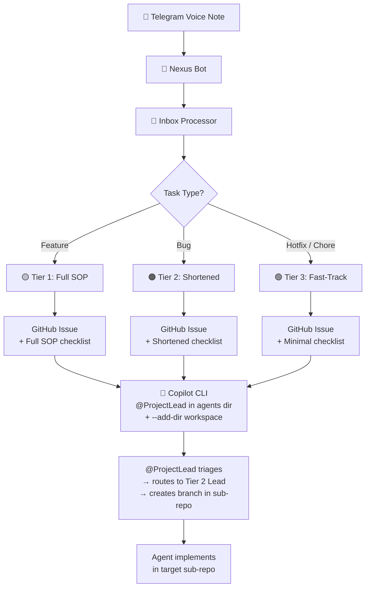

# Nexus - Telegram AI Task Router Bot

A Telegram bot powered by Google Gemini that intelligently routes voice messages and text input to project-specific
GitHub inboxes. Perfect for quickly capturing ideas and tasks on the go.

## Features

- **🎧 Voice Recognition**: Transcribe voice messages using Google Gemini
- **🤖 Smart Auto-Routing**: Automatically detect project and route tasks
- **📂 Menu-Driven Mode**: Manual project and task type selection
- **💾 File-Based Storage**: Save tasks directly to project inbox directories
- **🔐 User Authentication**: Only authorized users can access the bot

## Two Operating Modes

### 1. Hands-Free Mode (Default)

Simply send voice or text to the bot - it automatically:

- Transcribes audio (if applicable)
- Maps content to the appropriate project
- Routes and saves the task

### 2. Selection Mode (`/new` command)

Step through an interactive menu:

1. Select a project
2. Choose a task type (Feature, Bug, Improvement)
3. Send voice or text input
4. Task is saved with full metadata

## Supported Projects

- **casit** - Case Italia
- **wlbl** - Wallible
- **bm** - Biome
- **inbox** - General Inbox (default)

## Task Types

- ✨ Feature
- 🐛 Bug Fix
- 🚀 Improvement

## Setup Instructions

### Prerequisites

- Python 3.8+
- Telegram account
- Google Gemini API key
- FFmpeg (for audio processing)

### Installation

1. **Install FFmpeg**:
   ```bash
   sudo apt-get install ffmpeg
   ```

2. **Create virtual environment** (optional but recommended):
   ```bash
   cd /home/ubuntu/git/ghabs/nexus
   python3 -m venv venv
   source venv/bin/activate
   ```

3. **Install Python dependencies**:
   ```bash
   pip install -r requirements.txt
   ```

4. **Configure environment variables**:

   Edit `vars.secret` with your credentials:
   ```bash
GITHUB_AGENTS_REPO=Ghabs95/agents    # Where parent issues are created
   ```

   Add your values:
   ```
   TELEGRAM_TOKEN=your_telegram_bot_token
   AI_API_KEY=your_google_gemini_api_key
   AI_MODEL=gemini-2.0-flash
   ALLOWED_USER=your_user_id
   ```

   For manual testing, you can also export them:
   ```bash
   source vars.secret
   ```

### Running the Bot

#### Option 1: Manual Execution

```bash
python src/telegram_bot.py
```

The bot will start polling and display: `Nexus (Google Edition) Online...`

#### Option 2: Systemd Service (Production - Recommended)

For constant running with auto-restart:

1. Copy the service file:
   ```bash
   sudo cp nexus-bot.service /etc/systemd/system/
   ```

2. Enable and start the service:
   ```bash
   sudo systemctl enable nexus-bot
   sudo systemctl start nexus-bot
   ```

3. Check status:
   ```bash
   sudo systemctl status nexus-bot
   ```

4. View logs:
   ```bash
   sudo journalctl -u nexus-bot -f
   ```

Stop the service:

   ```bash
   sudo systemctl stop nexus-bot
   ```

### Inbox Processor Service (Optional)

To run the inbox processor in the background:

1. Copy `nexus-processor.service`:
   ```bash
   sudo cp nexus-processor.service /etc/systemd/system/
   ```
2. Enable and start:
   ```bash
   sudo systemctl enable nexus-processor
   sudo systemctl start nexus-processor
   ```

## Usage

### Auto-Router Mode

1. Start a chat with the bot
2. Send a voice message or text: *"Add pagination to user dashboard"*
3. Bot transcribes, analyzes, and automatically saves to the appropriate project inbox

### Menu Mode

1. Send `/new` command
2. Select a project from the inline keyboard
3. Select a task type
4. Send voice or text description
5. Task is saved with project and type metadata

## Inbox Processor & Automation

The `inbox_processor.py` watches for new tasks and automates the full workflow.

### Architecture



### What It Does

1. **Parses** the task file for type and content
2. **Moves** the file to the project workspace's `active` folder
3. **Creates a GitHub Issue** in the agents repo with an embedded SOP checklist
4. **Dispatches to Copilot CLI** — launches `copilot -p` in the agents directory with
   `--add-dir` pointing to the project workspace, so `@ProjectLead` can triage and
   route to the correct sub-repo and Tier 2 Lead

### Tiered Automation

| Task Type    | Tier          | SOP Steps                 | Workflow       |
|--------------|---------------|---------------------------|----------------|
| Feature      | 🟡 Full       | 9 steps (all agents)      | `/new_feature` |
| Bug          | 🟠 Shortened  | 6 steps (skip Vision/UX)  | `/bug_fix`     |
| Hotfix/Chore | 🟢 Fast-Track | 4 steps (@copilot direct) | `/bug_fix`     |

### Configuration (`vars.secret`)

```bash
GITHUB_AGENTS_REPO=Ghabs95/agents    # Where parent issues are created
```

## Bot Usage

- Local run (development):

```bash
python -m venv venv
source venv/bin/activate
pip install -r requirements.txt
python src/telegram_bot.py
```

- Run as systemd service (debian/ubuntu):

```bash
sudo systemctl daemon-reload
sudo systemctl enable --now nexus-bot.service
sudo systemctl status nexus-bot.service
```

- Common environment variables (set in `vars.secret`):

```
TELEGRAM_TOKEN=...
GITHUB_TOKEN=...
GITHUB_AGENTS_REPO=Ghabs95/agents
INBOX_DIR=./.github/inbox
```

- Example bot commands and expected responses:

```
/status      -> "Pending: 3 tasks (case_italia:2, wallible:1)"
/active      -> "Active: copilot:1, alice:2"
/assign 42   -> "Assigned issue #42 to @me"
/prepare 42  -> "Appended Copilot instructions to issue #42"
/implement 42-> "Requested implementation; @ProjectLead notified for approval"
```

These examples are illustrative — actual counts and messages depend on your inbox and agent mappings.

> **Prerequisite:** `gh` CLI must be authenticated on the server (`gh auth login`).

## Project Structure

```
nexus/
├── src/
│   └── telegram_bot.py       # Main bot application
├── requirements.txt          # Python dependencies
├── README.md                 # This file
├── .gitignore               # Git ignore rules
└── nexus-bot.service        # Systemd service file
```

## File Storage

Tasks are saved as markdown files in:

```
/home/ubuntu/git/{project}/.github/inbox/{task_type}_{message_id}.md
```

Example file content:

```markdown
# ✨ Feature

**Project:** Wallible
**Status:** Pending

Add dark mode support to mobile app
```

## Commands

- `/new` - Start selection mode
- `/cancel` - Cancel current conversation

## Configuration

Edit the following dictionaries in [src/telegram_bot.py](src/telegram_bot.py) to customize:

- `PROJECTS` - Add or modify supported projects
- `TYPES` - Customize task type categories
- `BASE_DIR` - Change task storage location

## Requirements

See [requirements.txt](requirements.txt) for all dependencies.

## Troubleshooting

- **"JSON Error" message**: Bot couldn't parse Gemini's response. Try rephrasing your input.
- **Audio not transcribing**: Ensure FFmpeg is installed and audio format is supported.
- **"Unauthorized user"**: Check `ALLOWED_USER` environment variable matches your Telegram user ID.

## License

This project is part of the Nexus task management system.
