# Nexus - Telegram AI Task Router Bot

A Telegram bot powered by Google Gemini that intelligently routes voice messages and text input to project-specific
GitHub inboxes. Perfect for quickly capturing ideas and tasks on the go.

## Features

- **🎧 Voice Recognition**: Transcribe voice messages using Google Gemini
- **🤖 Smart Auto-Routing**: Automatically detect project and route tasks
- **📂 Menu-Driven Mode**: Manual project and task type selection
- **💾 File-Based Storage**: Save tasks directly to project inbox directories
- **🔐 User Authentication**: Only authorized users can access the bot
- **⚡ GitHub Webhooks**: Real-time event processing (<2s latency) for instant workflow automation
- **⏱️ Timeout Handling**: Auto-detect and kill stuck agents, intelligent retry logic (3 attempts per agent)
- **🔄 Failure Recovery**: Automatic retry with exponential backoff for GitHub CLI calls
- **🎯 Conditional Routing**: Smart workflow tier detection from issue content and labels
- **📊 Audit Trail**: Complete history of workflow state changes, agent launches, timeouts, and retries
- **⏸️ Workflow Control**: Pause/resume/stop individual workflows for manual intervention
- **📈 Analytics Dashboard**: Real-time performance metrics and agent leaderboards via `/stats` command
- **🛡️ Error Handling**: User-friendly error messages with automatic retry and startup validation
- **🧪 Test Coverage**: Comprehensive unit tests (115 tests) for critical system components
- **📝 Log Management**: Centralized logging with automatic 7-day rotation
- **⌨️ Interactive Notifications**: Inline keyboard buttons for quick actions (approve, pause, view logs)
- **🔀 PR Review Integration**: Auto-detects linked PRs when workflows complete, one-click approve/review

## Two Operating Modes

### 1. Hands-Free Mode (Default)

Simply send voice or text to the bot - it automatically:

- Transcribes audio (if applicable)
- Maps content to the appropriate project
- Routes and saves the task

### 2. Selection Mode (`/new` command)

Step through an interactive menu:

1. Select a project
2. Choose a task type (Feature, Bug, Improvement)
3. Send voice or text input
4. Task is saved with full metadata

## Supported Projects

- **casit** - Case Italia
- **wlbl** - Wallible
- **bm** - Biome
- **nexus** - Nexus Core

## Task Types

- ✨ Feature
- 🐛 Bug Fix
- 🚀 Improvement

## Setup Instructions

### Prerequisites

- Python 3.8+
- Telegram account
- FFmpeg (for audio processing)

### Installation

1. **Install FFmpeg**:
   ```bash
   sudo apt-get install ffmpeg
   ```

2. **Create virtual environment** (optional but recommended):
   ```bash
   cd /home/ubuntu/git/ghabs/nexus
   python3 -m venv venv
   source venv/bin/activate
   ```

3. **Install Python dependencies**:
   ```bash
   pip install -r requirements.txt
   ```
   
   This installs all required packages including:
   - `requests` - HTTP client for notifications and health checks
   - `python-telegram-bot` - Telegram bot framework
   - `python-dotenv` - Environment variable management
   - `pytest`, `pytest-mock`, `pytest-asyncio` - Testing framework (115 unit tests)

4. **Configure environment variables**:

   Edit `vars.secret` with your credentials:
   ```bash
   PROJECT_CONFIG_PATH=config/project_config.yaml    # Per-project settings
   ```

   Add your values:
   ```
   TELEGRAM_TOKEN=your_telegram_bot_token
   ALLOWED_USER=your_user_id
   ```

   In config/project_config.yaml, make sure the nexus project points to the
   nexus-core workspace so agent PRs land in the correct repo.

   For manual testing, you can also export them:
   ```bash
   source vars.secret
   ```

### Running the Bot

#### Option 1: Manual Execution

```bash
python src/telegram_bot.py
```

The bot will start polling and display: `Nexus (Google Edition) Online...`

#### Option 2: Systemd Service (Production - Recommended)

For constant running with auto-restart:

1. Copy the service file:
   ```bash
   sudo cp nexus-bot.service /etc/systemd/system/
   ```

2. Enable and start the service:
   ```bash
   sudo systemctl enable nexus-bot
   sudo systemctl start nexus-bot
   ```

3. Check status:
   ```bash
   sudo systemctl status nexus-bot
   ```

4. View logs:
   ```bash
   sudo journalctl -u nexus-bot -f
   ```

Stop the service:

   ```bash
   sudo systemctl stop nexus-bot
   ```

### Inbox Processor Service (Optional)

To run the inbox processor in the background:

1. Copy `nexus-processor.service`:
   ```bash
   sudo cp nexus-processor.service /etc/systemd/system/
   ```
2. Enable and start:
   ```bash
   sudo systemctl enable nexus-processor
   sudo systemctl start nexus-processor
   ```

## Usage

### Auto-Router Mode

1. Start a chat with the bot
2. Send a voice message or text: *"Add pagination to user dashboard"*
3. Bot transcribes, analyzes, and automatically saves to the appropriate project inbox

### Menu Mode

1. Send `/new` command
2. Select a project from the inline keyboard
3. Select a task type
4. Send voice or text description
5. Task is saved with project and type metadata

## Inbox Processor & Automation

The `inbox_processor.py` watches for new tasks and automates the full workflow.

### Architecture

```mermaid
flowchart TD
    A["📱 Telegram Voice Note"] --> B["🤖 Nexus Bot"]
    B --> C["📂 Inbox Processor"]
    C --> D{"Task Type?"}

    D -->|Feature| E["🟡 Tier 1: Full SOP"]
    D -->|Bug| F["🟠 Tier 2: Shortened"]
    D -->|Hotfix / Chore| G["🟢 Tier 3: Fast-Track"]

    E --> H["GitHub Issue\n+ Full SOP checklist"]
    F --> I["GitHub Issue\n+ Shortened checklist"]
    G --> J["GitHub Issue\n+ Minimal checklist"]

    H --> K["🤖 Copilot CLI\n@ProjectLead in agents dir\n+ --add-dir workspace"]
    I --> K
    J --> K

    K --> L["@ProjectLead triages\n→ routes to Tier 2 Lead\n→ creates branch in sub-repo"]
    L --> M["Agent implements\nin target sub-repo"]
```



### What It Does

1. **Parses** the task file for type and content
2. **Moves** the file to the project workspace's `active` folder
3. **Creates a GitHub Issue** in the agents repo with an embedded SOP checklist
4. **Dispatches to Copilot CLI** — launches `copilot -p` in the agents directory with
   `--add-dir` pointing to the project workspace, so `@ProjectLead` can triage and
   route to the correct sub-repo and Tier 2 Lead

### Tiered Automation

| Task Type    | Tier          | SOP Steps                 | Workflow       |
|--------------|---------------|---------------------------|----------------|
| Feature      | 🟡 Full       | 9 steps (all agents)      | `/new_feature` |
| Bug          | 🟠 Shortened  | 6 steps (skip Vision/UX)  | `/bug_fix`     |
| Hotfix/Chore | 🟢 Fast-Track | 4 steps (@copilot direct) | `/bug_fix`     |

## Advanced Features

### ⏱️ Timeout Handling & Auto-Retry

The system automatically detects and recovers from stuck agents:

- **Detection**: Monitors log files for agents stuck >60 seconds without updates
- **Recovery**: Automatically kills unresponsive processes
- **Retry Logic**: Up to 3 attempts per agent per issue (MAX_RETRIES=2)
- **Tracking**: Per-issue, per-agent retry counters reset on success
- **Audit Logging**: All timeouts, kills, and retries logged to audit trail

**Implementation**: [src/agent_monitor.py](src/agent_monitor.py) - `AgentMonitor` class

### 🎯 Conditional Workflow Routing

Issues are intelligently routed to the appropriate workflow tier:

- **Label Detection**: Checks for explicit `workflow:*` labels (full/shortened/fast-track)
- **Content Analysis**: NLP-based suggestions from issue title and description
  - Critical/Hotfix keywords → fast-track (4 steps, quick)
  - Bug keywords → shortened (6 steps, triage + fix)
  - Feature keywords → full (9 steps, complete design)
- **Fallback**: Uses task type if content analysis unavailable
- **Integration**: Applied when issue is created in `process_file()`

**Implementation**: [src/agent_monitor.py](src/agent_monitor.py) - `WorkflowRouter` class

### 📊 Audit Trail System

Complete audit history for all workflow activities:

**Tracked Events**:
- `AGENT_LAUNCHED` - Agent starts (with PID)
- `AGENT_TIMEOUT_KILL` - Stuck agent killed
- `AGENT_RETRY` - Retry attempt made
- `AGENT_FAILED` - Agent exceeded max retries
- `WORKFLOW_PAUSED` / `RESUMED` / `STOPPED` - User controls
- `WORKFLOW_STARTED` - New workflow created

**Access**: `/audit <issue#>` Telegram command
- Shows formatted history with emojis and timestamps
- Example: `🚀 AGENT_LAUNCHED (2026-02-16 22:09:50): Launched Copilot agent...`

**Storage**: logs/audit.log (append-only, persistent across restarts)

### ⏸️ Workflow Control Commands

Users can manage individual issue workflows:

- `/pause <issue#>` - Pause auto-chaining (agents work, no auto-launch)
- `/resume <issue#>` - Resume auto-chaining
- `/stop <issue#>` - Stop completely (kill process, close issue)

**Implementation**: [src/commands/workflow.py](src/commands/workflow.py)

### 📈 Analytics & Performance Metrics

Real-time system analytics accessible via `/stats [days]` command:

**System Metrics**:
- Total issues processed (completed, active, failed)
- Overall completion rate percentage
- Average workflow duration
- Issues per workflow tier distribution

**Agent Performance**:
- Launches, timeouts, retries, failures per agent
- Success rate and average duration
- Agent leaderboard ranking by activity

**Customization**: Specify lookback window (1-365 days, default: 30)

**Implementation**: [src/analytics.py](src/analytics.py) - `AuditLogParser`, `get_stats_report()`

### 🛡️ Error Handling & Resilience

Comprehensive error handling for reliability:

**Automatic Retry Logic**:
- GitHub CLI commands retry up to 3 times with exponential backoff
- Base delay: 1s, grows to max 30s between attempts
- Applied to: issue creation, listing, viewing, commenting

**Startup Validation**:
- Validates all required environment variables
- Tests DATA_DIR writability
- Validates project_config.yaml structure
- Fails fast with detailed error messages

**User-Friendly Errors**:
- Technical errors converted to actionable messages
- Timeout errors suggest checking issue status
- Configuration errors provide fix instructions
- Network errors indicate automatic retry in progress

**Implementation**: [src/error_handling.py](src/error_handling.py) - `retry_with_backoff()`, `run_command_with_retry()`, `validate_configuration()`

### Configuration (`vars.secret`)

```bash
PROJECT_CONFIG_PATH=config/project_config.yaml    # Per-project settings
```

## Bot Usage

- Local run (development):

```bash
python -m venv venv
source venv/bin/activate
pip install -r requirements.txt
python src/telegram_bot.py
```

- Run as systemd service (debian/ubuntu):

```bash
sudo systemctl daemon-reload
sudo systemctl enable --now nexus-bot.service
sudo systemctl status nexus-bot.service
```

- Common environment variables (set in `vars.secret`):

```
TELEGRAM_TOKEN=...
GITHUB_TOKEN=...
PROJECT_CONFIG_PATH=config/project_config.yaml
INBOX_DIR=./.github/inbox
```

- Example bot commands and expected responses:

```
/status      -> "Pending: 3 tasks (case_italia:2, wallible:1)"
/active      -> "Active: copilot:1, alice:2"
/assign 42   -> "Assigned issue #42 to @me"
/prepare 42  -> "Appended Copilot instructions to issue #42"
/implement 42-> "Requested implementation; @ProjectLead notified for approval"
```

These examples are illustrative — actual counts and messages depend on your inbox and agent mappings.

> **Prerequisite:** `gh` CLI must be authenticated on the server (`gh auth login`).

## Project Structure

```
nexus/
├── src/
│   ├── telegram_bot.py           # Main bot application
│   ├── inbox_processor.py        # Auto-chaining orchestrator
│   ├── agent_monitor.py          # Timeout/retry/routing logic
│   ├── config.py                 # Centralized configuration
│   ├── state_manager.py          # Workflow state & audit trail
│   ├── models.py                 # Type-safe data classes
│   ├── orchestration.py          # Workflow sequencing logic
│   ├── error_handling.py         # Retry logic & error formatting
│   ├── analytics.py              # Audit log parsing & metrics
│   └── commands/
│       └── workflow.py           # Pause/resume/stop handlers
├── tests/
│   ├── conftest.py               # Pytest fixtures & configuration
│   ├── test_error_handling.py    # Error handling unit tests
│   ├── test_analytics.py         # Analytics unit tests
│   └── test_agent_monitor.py     # Agent monitoring unit tests
├── data/                         # Persistent state (git-ignored)
│   ├── workflow_state.json       # Pause/resume/stop state
│   ├── launched_agents.json      # Recent agent tracking
│   └── tracked_issues.json       # User subscriptions
├── logs/                         # Log files (git-ignored, 7-day retention)
│   ├── audit.log                 # Workflow event audit trail
│   ├── inbox_processor.log       # Processor service logs
│   ├── telegram_bot.log          # Bot service logs
│   └── webhook.log               # Webhook server logs
├── requirements.txt              # Python dependencies
├── logrotate.conf                # Log rotation configuration (7-day retention)
├── README.md                     # This file
├── .gitignore                    # Git ignore rules
├── setup-webhook.sh              # Webhook setup script
├── WEBHOOK-REFERENCE.md          # Webhook operations guide
├── nexus-bot.service             # Systemd service file (Telegram bot)
├── nexus-processor.service       # Inbox processor service file
├── nexus-webhook.service         # GitHub webhook server service file
└── nexus-health.service          # Health check endpoint service file
```

## File Storage

Tasks are saved as markdown files in:

```
/home/ubuntu/git/{project}/.github/inbox/{task_type}_{message_id}.md
```

Example file content:

```markdown
# ✨ Feature

**Project:** Wallible
**Status:** Pending

Add dark mode support to mobile app
```

## Commands

### Basic Commands
- `/new` - Start selection mode
- `/cancel` - Cancel current conversation
- `/help` - Show all available commands

### Monitoring & Analytics
- `/status` - View pending tasks in inbox
- `/active` - View currently active tasks
- `/stats [days]` - View system analytics and performance metrics (default: 30 days)
- `/logs <issue#>` - View task execution logs
- `/logsfull <issue#>` - Full log lines (no truncation)
- `/audit <issue#>` - View workflow audit trail (state changes, agent launches, timeouts)
- `/comments <issue#>` - View issue comments

### Interactive Notifications

All workflow notifications include **inline keyboard buttons** for quick actions:

**Agent Needs Input**:
- 📝 View Full - See complete agent message
- 🔗 GitHub - Open issue in browser
- 💬 Respond - Reply to agent

**Workflow Started**:
- 📋 Logs - View execution logs
- 📊 Status - Check workflow status
- 🔗 GitHub - Open issue
- ⏸️ Pause - Pause auto-chaining

**Agent Completed**:
- 📋 Logs - View execution logs
- 🔗 GitHub - Open issue
- ⏸️ Pause Chain - Pause before next agent
- 🛑 Stop - Stop workflow

**Implementation Requested**:
- ✅ Approve - Auto-posts approval comment
- ❌ Reject - Auto-posts rejection comment
- 📋 View Details - See issue details
- 🔗 GitHub - Open issue

**Workflow Completed** (with PR):
- 🔗 View PR - Open pull request in browser
- 🔗 View Issue - Open issue in browser
- ✅ Approve - Auto-approve the PR (posts comment)
- 📝 Request Changes - Request changes (posts comment)
- 📋 Full Logs - View complete execution logs
- 📊 Audit - View audit trail

**Workflow Completed** (no PR):
- 📋 Full Logs - View complete execution logs
- 🔗 GitHub - Open issue
- 📊 Audit - View audit trail

> **Note**: When the final agent completes, the system automatically searches for linked PRs and notifies you with one-click review buttons. If no PR is found, you're notified that implementation may still be in progress.

Buttons are context-aware and adapt based on workflow state (retrying, failed, paused, etc.).

### Workflow Control
- `/pause <issue#>` - Pause auto-chaining for an issue
- `/resume <issue#>` - Resume auto-chaining for an issue
- `/stop <issue#>` - Stop workflow and kill running process
- `/continue <issue#>` - Check stuck agent status
- `/kill <issue#>` - Manually stop agent process
- `/reprocess <issue#>` - Re-run agent processing

### Agent Management
- `/agents <project>` - List all agents for a project
- `/direct <project> <@agent> <message>` - Send direct request to an agent
- `/respond <issue#> <text>` - Respond to agent questions
- `/assign <issue#>` - Assign issue to yourself
- `/implement <issue#>` - Request Copilot implementation
- `/prepare <issue#>` - Add Copilot-friendly instructions

## Configuration

Edit the following dictionaries in [src/telegram_bot.py](src/telegram_bot.py) to customize:

- `PROJECTS` - Add or modify supported projects
- `TYPES` - Customize task type categories
- `BASE_DIR` - Change task storage location

### Advanced Configuration

Core configuration is centralized in [src/config.py](src/config.py):

- **PROJECT_CONFIG**: Map projects to workspace, agent directories, and workflow definitions
- **STUCK_AGENT_THRESHOLD**: Timeout threshold in seconds (default: 60)
- **DATA_DIR**: Location for persistent state and audit logs

Workflow orchestration is defined in YAML files (see `ghabs_org_workflow.yaml` in agents repo).

### PR Merge Approval Policy

The system enforces human review before @OpsCommander can merge pull requests. This prevents accidental auto-merges and ensures proper oversight.

**Configuration**: [config/project_config.yaml](config/project_config.yaml)

```yaml
require_human_merge_approval: always  # Enforce human review for all projects
```

**Policy Options**:
- `always` - **Recommended**: Human approval REQUIRED for all PRs (overrides workflow settings)
- `workflow-based` - Workflow YAML controls per-workflow/per-step merge behavior  
- `never` - Allow auto-merge (NOT recommended for production)

**Workflow-Level Control**: [agents/workflows/ghabs_org_workflow.yaml](agents/workflows/ghabs_org_workflow.yaml)

```yaml
monitoring:
  require_human_merge_approval: true  # Only applies when project policy is 'workflow-based'
```

**Agent Behavior**: @OpsCommander will:
- NEVER merge PRs automatically when policy is `always`
- Post comment: 🚀 Deployment ready. PR requires human review before merge
- Wait for explicit human approval before merging

See [OpsCommander skill documentation](agents/wlbl-agents/.agent/skills/ops_commander/SKILL.md) for details.

### Persistent State

The system maintains state in `data/` directory:

- `workflow_state.json` - Pause/resume/stop state for each issue
- `launched_agents.json` - Recently launched agent tracking
- `tracked_issues.json` - User subscriptions

Logs are stored in `logs/` directory:

- `audit.log` - Append-only audit trail of all events
- `inbox_processor.log` - Inbox processor service logs
- `telegram_bot.log` - Telegram bot service logs

**Log Rotation**: Logs are automatically rotated daily with 7-day retention using `logrotate`:

To enable system-wide log rotation:
```bash
sudo cp logrotate.conf /etc/logrotate.d/nexus
```

Or run manually:
```bash
logrotate -s /var/tmp/logrotate.state logrotate.conf
```

Features:
- Daily rotation with 7-day retention
- Automatic compression of old logs (gzip)
- Date-stamped archives (e.g., `audit.log-20260216.gz`)
- Automatic cleanup after 7 days

## Architecture Overview

### Modular Design

The system is split into focused, reusable modules:

**[src/config.py](src/config.py)**
- Centralized configuration (PROJECT_CONFIG, thresholds, paths)
- Single source of truth for all constants and settings
- Clean imports for other modules
- Lazy-loading project configuration from YAML

**[src/models.py](src/models.py)**
- Type-safe data structures (Enums, Dataclasses)
- WorkflowState, IssueState, TierName enums
- Issue, Workflow, WorkflowStep, Agent classes

**[src/state_manager.py](src/state_manager.py)**
- Load/save workflow state to JSON
- Audit logging (append-only)
- Get workflow history with timestamps
- Persist across service restarts

**[src/agent_monitor.py](src/agent_monitor.py)**
- AgentMonitor: Timeout detection, process killing, retry tracking
- WorkflowRouter: Label detection, NLP-based tier suggestions
- Pluggable into any monitoring loop

**[src/orchestration.py](src/orchestration.py)**
- WorkflowOrchestrator: Agent sequencing and tier detection
- CompletionDetector: Parse completion markers from logs
- Determine who finishes next in workflow

**[src/commands/workflow.py](src/commands/workflow.py)**
- Pause/resume/stop handlers for Telegram commands
- Clean separation from main bot logic
- Reusable by other command handlers

**[src/error_handling.py](src/error_handling.py)**
- Retry logic with exponential backoff decorator
- GitHub CLI command retry wrapper (3 attempts, automatic timeout)
- Startup configuration validation (environment variables, workflow structure)
- User-friendly error message formatting for Telegram
- Safe file I/O operations with graceful error handling

**[src/analytics.py](src/analytics.py)**
- Audit log parser for workflow events
- System metrics calculation (completion rate, avg duration, tier distribution)
- Per-agent performance tracking (launches, timeouts, retries, failures)
- Agent leaderboard ranking by activity
- Formatted stats reports for Telegram `/stats` command

**[src/inbox_processor.py](src/inbox_processor.py)**
- Main auto-chaining orchestrator
- File processing pipeline
- Integration point for all subsystems
- check_stuck_agents() - uses AgentMonitor
- check_completed_agents() - uses orchestration
- Uses StateManager for audit and persistence

**[src/telegram_bot.py](src/telegram_bot.py)**
- Telegram interface for users
- Imports commands from config and state_manager
- ~40 command handlers
- Minimal business logic (delegated to modules)

### Data Flow

```
User sends /new or voice message
  ↓
telegram_bot.py (message handler)
  ↓
process_file() in inbox_processor.py
  ├─ Parse metadata (type, content)
  ├─ WorkflowRouter.suggest_tier_label() (content analysis)
  ├─ get_sop_tier() with intelligent routing
  ├─ StateManager.audit_log() "WORKFLOW_STARTED"
  └─ Create GitHub issue + launch agent
  
Agent runs in background
  ↓
inbox_processor.py polling loops (every 30 seconds)
  ├─ check_stuck_agents()
  │  ├─ AgentMonitor.check_timeout()
  │  ├─ AgentMonitor.kill_agent() if stuck
  │  └─ AgentMonitor.should_retry() decision
  │
  └─ check_completed_agents()
     ├─ Get GitHub comments
     ├─ Detect "Ready for @NextAgent" marker
     ├─ get_previous_agent() identifies who finished
     ├─ AgentMonitor.reset_retries() on success
     └─ Launch next agent in workflow

Workflow completes
  ↓
StateManager.audit_log() "WORKFLOW_COMPLETED"
Issue closed or marked done
```

## Requirements

See [requirements.txt](requirements.txt) for all dependencies.

## Troubleshooting

### General Issues

- **"JSON Error" message**: Bot couldn't parse Gemini's response. Try rephrasing your input.
- **Audio not transcribing**: Ensure FFmpeg is installed and audio format is supported.
- **"Unauthorized user"**: Check `ALLOWED_USER` environment variable matches your Telegram user ID.

### Timeout & Retry Issues

- **Agent keeps timing out**: Check if process is actually running with `pgrep -af "copilot.*<issue#>"`. If not, check logs in `.github/tasks/logs/`.
- **Retries not working**: Verify MAX_RETRIES=2 in [src/agent_monitor.py](src/agent_monitor.py). Check audit trail with `/audit <issue#>`.
- **Retry counter stuck**: Kill the service (`sudo systemctl restart nexus-processor`) to reset in-memory counters.

### Audit Trail Issues

- **Can't see audit history**: Check if logs/audit.log exists and is readable. Run `/audit <issue#>` with an existing issue.
- **Audit log grows too large**: Log rotation is configured for 7-day retention. Enable it with `sudo cp logrotate.conf /etc/logrotate.d/nexus`.
- **Missing events**: Verify StateManager.audit_log() is being called. Check logs/inbox_processor.log for errors.

### GitHub API & Network Issues

- **"GitHub API error"**: The system automatically retries GitHub CLI commands up to 3 times with exponential backoff. Check logs/inbox_processor.log for retry attempts.
- **Rate limit errors**: GitHub CLI calls will be retried automatically. If persistent, check your GitHub API rate limit with `gh api rate_limit`.
- **Network timeouts**: Commands have 30-second timeout with automatic retry. Transient failures are handled gracefully.
- **Configuration validation errors**: System validates all required environment variables and configuration on startup. Check startup logs for detailed error messages.

### Workflow Control Issues

- **Can't pause/resume issue**: Verify issue number is correct and exists in GitHub. Check data/workflow_state.json.
- **Workflow state not persisting**: Restart services after changes: `sudo systemctl restart nexus-bot nexus-processor`

### Service Issues

- **Service won't start**: Check `sudo journalctl -u nexus-bot -n 50` for startup errors. Verify all imports work with `cd src && python3 -c "import config, state_manager, agent_monitor"`
- **Process crashes after restart**: Check file permissions on data/ directory: `chmod 755 data/`
- **High memory usage**: Check for stuck processes with `ps aux | grep copilot`. Kill orphaned processes with `pkill -f "copilot"`

## Development & Testing

### Running Unit Tests

The project includes comprehensive unit tests using pytest:

```bash
# Run all tests (115 tests)
python3 -m pytest tests/ -v

# Run specific test modules
python3 -m pytest tests/test_error_handling.py -v
python3 -m pytest tests/test_analytics.py -v
python3 -m pytest tests/test_agent_monitor.py -v
python3 -m pytest tests/test_rate_limiter.py -v
python3 -m pytest tests/test_user_manager.py -v
python3 -m pytest tests/test_notifications.py -v
python3 -m pytest tests/test_state_manager.py -v

# Run with coverage report
python3 -m pytest tests/ --cov=src --cov-report=html
```

**Test Coverage (115 total tests):**
- `tests/test_error_handling.py` - 16 tests for retry logic, validation, error formatting
- `tests/test_analytics.py` - 10 tests for audit log parsing and metrics
- `tests/test_agent_monitor.py` - 21 tests for timeout detection and workflow routing
- `tests/test_rate_limiter.py` - 15 tests for rate limiting and sliding window
- `tests/test_user_manager.py` - 17 tests for user tracking and per-project subscriptions
- `tests/test_notifications.py` - 16 tests for inline keyboard builder and notifications
- `tests/test_state_manager.py` - 20 tests for workflow state, tracked issues, audit logging
- `tests/conftest.py` - Shared fixtures and test configuration

### Quick Validation Tests

```bash
cd src

# Test imports
python3 -c "from config import PROJECT_CONFIG; from state_manager import StateManager; print('✅ Imports OK')"

# Test error handling
python3 -c "from error_handling import retry_with_backoff; print('✅ Error Handling OK')"

# Test analytics
python3 -c "from analytics import AuditLogParser; print('✅ Analytics OK')"

# Test agent monitoring
python3 -c "from agent_monitor import AgentMonitor; print('✅ AgentMonitor OK')"
```

### Manual Testing Workflow

1. **Create a test issue**: Send `/new` in Telegram and create a feature task
2. **Monitor in real-time**: `sudo journalctl -u nexus-processor -f`
3. **Check audit trail**: `/audit <issue#>` in Telegram
4. **Simulate timeout** (optional): Kill agent process manually and watch recovery:
   ```bash
   pkill -f "copilot.*<issue#>"
   # Watch for auto-kill and retry in logs
   ```
5. **Test pause/resume**: 
   ```bash
   /pause <issue#>    # Issue should stop auto-chaining
   /resume <issue#>   # Issue should resume
   /stop <issue#>     # Issue should stop completely
   ```

### Code Organization Guidelines

- **config.py**: Configuration only (no business logic)
- **models.py**: Data structures only (enum/dataclass definitions)
- **state_manager.py**: Persistence only (load/save/audit)
- **agent_monitor.py**: Monitoring logic (timeout/retry/routing)
- **orchestration.py**: Workflow sequencing logic
- **commands/**: Telegram command handlers
- **inbox_processor.py**: Integration point (imports and uses others)
- **telegram_bot.py**: User interface (minimal logic)

## Documentation

### 📚 Complete Documentation Suite

- **[README.md](README.md)** (this file) - User guide, features, and command reference
- **[docs/RESTORE.md](docs/RESTORE.md)** - Complete restore & replication guide (system recovery)
- **[docs/DEPLOYMENT.md](docs/DEPLOYMENT.md)** - Production deployment guide and operations
- **[docs/ARCHITECTURE.md](docs/ARCHITECTURE.md)** - System design, data flows, and component details
- **[docs/AI-ORCHESTRATOR.md](docs/AI-ORCHESTRATOR.md)** - AI tool orchestration & Copilot/Gemini integration
- **[docs/CONTRIBUTING.md](docs/CONTRIBUTING.md)** - Development setup and contribution guidelines
- **[docs/WEBHOOK-REFERENCE.md](docs/WEBHOOK-REFERENCE.md)** - Webhook server operations guide
- **[docs/WEBHOOK-QUICKSTART.md](docs/WEBHOOK-QUICKSTART.md)** - Quick webhook setup guide

### Quick Links

| Need | Document | Section |
|------|----------|---------|
| Restore or replicate system | [RESTORE.md](docs/RESTORE.md) | Complete guide (infrastructure + services) |
| Install system | [DEPLOYMENT.md](docs/DEPLOYMENT.md) | Initial Setup |
| Understand AI tools & routing | [AI-ORCHESTRATOR.md](docs/AI-ORCHESTRATOR.md) | Tool selection strategy |
| Setup webhooks | [WEBHOOK-REFERENCE.md](docs/WEBHOOK-REFERENCE.md) | GitHub Configuration |
| Understand architecture | [ARCHITECTURE.md](docs/ARCHITECTURE.md) | System Overview |
| Add new feature | [CONTRIBUTING.md](docs/CONTRIBUTING.md) | Making Changes |
| Deploy to production | [DEPLOYMENT.md](docs/DEPLOYMENT.md) | Service Installation |
| Troubleshoot webhooks | [WEBHOOK-REFERENCE.md](docs/WEBHOOK-REFERENCE.md) | Troubleshooting |
| Troubleshoot issues | [DEPLOYMENT.md](docs/DEPLOYMENT.md) | Troubleshooting |

## License

This project is part of the Nexus task management system.
